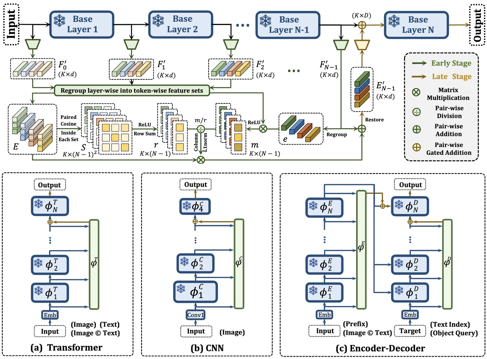

# SHERL
*PyTorch implementation for ECCV2024 paper of [**“SHERL: Synthesizing High Accuracy and Efficient Memory for Resource-Limited Transfer Learning”**](http://arxiv.org/abs/2407.07523).* 

*It is built on top of the [UniPT](https://github.com/Paranioar/UniPT), [LST](https://github.com/ylsung/Ladder-Side-Tuning), [VSE-infty](https://github.com/woodfrog/vse_infty), [CLIP-ViL](https://github.com/clip-vil/CLIP-ViL), [CLIP4Clip](https://github.com/ArrowLuo/CLIP4Clip), [MDETR](https://github.com/ashkamath/mdetr) and [Awesome_Pretraining_Transfering](https://github.com/Paranioar/Awesome_Matching_Pretraining_Transfering).* 

*If any problems, please contact me at r1228240468@gmail.com. (diaohw@mail.dlut.edu.cn is deprecated)*

## Introduction

We propose an innovative strategy called **SHERL** for resource-limited scenarios. It decouples the entire adaptation into two successive and complementary processes. In the early route, intermediate outputs are consolidated via an anti-redundancy operation, enhancing their compatibility for subsequent interactions; thereby in the late route, utilizing minimal late pre-trained layers could alleviate the peak demand on memory overhead and regulate these fairly flexible features into more adaptive and powerful representations for new domains.   

**The framework and applications of SHERL:**   

## Task & Model Details

**Image-Text Retrieval: *[VSE-infty](https://github.com/Paranioar/SHERL/blob/main/VSE-infty/README.md)*** with the strongest combination of a BERT-base model and a ResNeXt-101(32×8d) backbone pre-trained on Instagram (WSL).

**Video-Text Retrieval: *[CLIP4Clip](https://github.com/Paranioar/SHERL/blob/main/CLIP4Clip/README.md)*** with the pre-trained CLIP network using Text Transformer and ViT-B/32 models.

**Question Answering: *[CLIP-ViL](https://github.com/Paranioar/SHERL/blob/main/CLIP-ViL/README.md)*** that utilizes the CLIP image backbone and encodes the text into the word embedding sequence, followed by a cross-modal Transformer.

**Visual Grounding: *[MDETR](https://github.com/Paranioar/SHERL/blob/main/MDETR/README.md)*** with a pre-trained ResNet-101 vision encoder, a RoBERTa-base text encoder, and a query-based encoder-decoder Transformer.

**Language-only Tasks: *[LST](https://github.com/Paranioar/SHERL/blob/main/Ladder-Side-Tuning/README.md)*** with pre-trained T5-Base, T5-Large, T5-3B text encoders, using a standard encoder-decoder Transformer.

Please refer to their respective README.md file for the detailed settings.

## Guidance for Applications
We summarize the positions where SHERL is defined and invoked in each work (similar to [UniPT](https://github.com/Paranioar/UniPT)):  
**We hope these help you quickly realize your idea beyond SHERL.**

## Reference

If SHERL is useful for your research, please cite the following paper:

        @article{Diao2024SHERL,
            title={SHERL: Synthesizing High Accuracy and Efficient Memory for Resource-Limited Transfer Learning},
            author={Diao, Haiwen and Wan, Bo and Jia, Xu and Zhuge, Yunzhi and Zhang, Ying and Lu, Huchuan and Chen, Long},
            journal={arXiv preprint arXiv:2407.07523},
            year={2024}
        }

## License

[Apache License 2.0](http://www.apache.org/licenses/LICENSE-2.0).  
